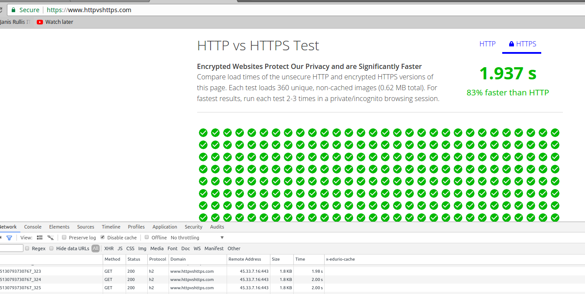
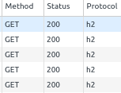

## H2 vs HTTP
* https://www.httpvshttps.com/

## How to test if h2 is enabled

### In dev tools/network
* show Protocol col. Should display h2.

## OR 
* Check in https://tools.keycdn.com/http2-test
