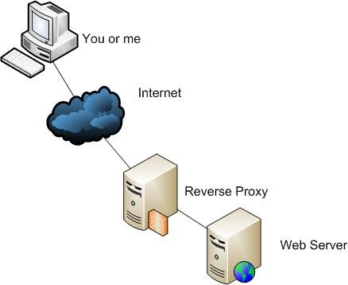

### / [nginx](./../) / [docs](./)

-----------------------------------------------------------------------------------

# What is a reverse proxy?

## Opposite of the regular (forward) proxy

### Forward proxy
When a client connects to a VPN proxy (like hidemyass.com) then website servers
does not know it's original IP.

### Reverse proxy
Multiple servers connects to 1 proxy and client can not determine the original
machines IP.
